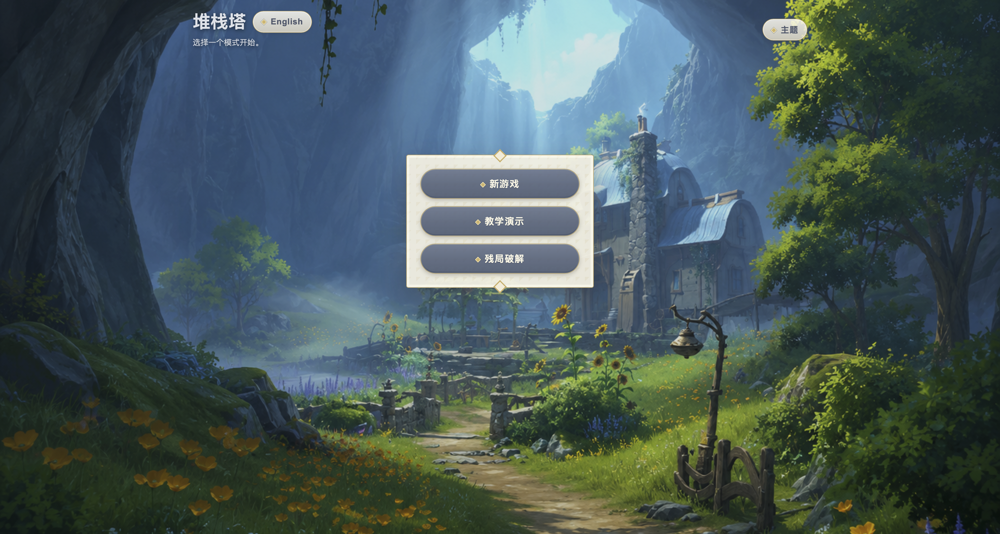
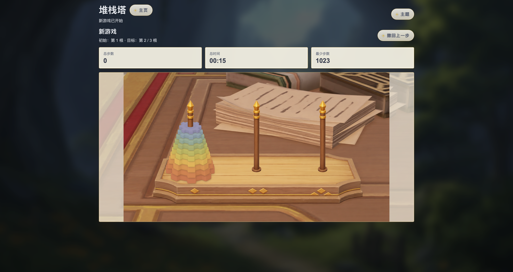
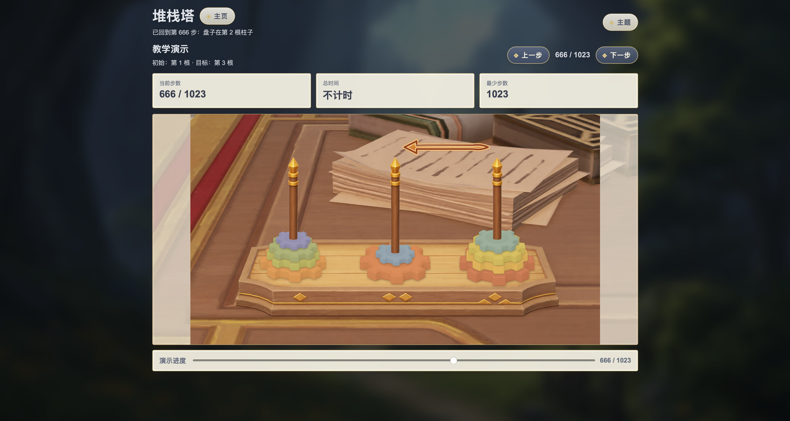

# 堆栈塔

[English](README_en.md)

堆栈塔是一款可直接在浏览器中运行的纯静态益智游戏，以经典汉诺塔规则为核心，并加入原神风格主题、教学演示和残局破解功能。项目不需要服务器或后端服务，可直接本地打开，也可通过 GitHub Pages 部署。

**在线体验：** [https://rrrome.github.io/hanoi/](https://rrrome.github.io/hanoi/)

## 项目特点

- 提供新游戏、教学演示和残局破解三种模式。
- 盘子数量可在 2 到 10 之间选择，默认数量为 7。
- 支持中文与英文界面，以及原神、浅色和深色主题。
- 实时显示移动步数、游戏时间和理论最少步数。
- 教学模式通过方向箭头、步骤按钮和进度滑块展示最优解。
- 原神主题包含齿轮棋盘、主题化界面和齿轮落位火花效果。
- 所有核心功能均在浏览器本地运行，不上传游戏数据。

## 界面预览

### 主页



原神风格主页集中展示三种游戏入口，并可快速切换语言与主题。

### 新游戏



新游戏支持 2 至 10 个齿轮，并实时记录当前步数、用时和理论最少步数。

### 教学演示



教学模式使用箭头标示每一步的移动方向，可通过上一步、下一步或进度滑块查看完整解法。

## 游戏模式

### 新游戏

选择盘子数量、初始柱和目标柱后开始游戏。玩家只能移动每根柱子最上方的齿轮，并且不能将较大的齿轮放到较小的齿轮上。游戏支持撤回操作，撤回的移动不会计入总步数。

### 教学演示

根据当前盘子数量、初始柱和目标柱生成理论最少步骤。界面会显示当前步骤的移动箭头，并支持逐步播放或通过滑块快速跳转。

### 残局破解

可以先拖动齿轮设置任意合法残局，再由程序从当前状态计算到达目标柱的最少完成步骤，适合练习和研究不同局面。

## 运行项目

项目无需安装依赖。下载或克隆仓库后，直接用浏览器打开根目录中的 `index.html`：

```bash
git clone https://github.com/rrrome/hanoi.git
cd hanoi
open index.html
```

Windows 用户可以双击 `index.html`，或使用任意本地静态文件服务器运行项目。

## 项目结构

```text
.
├── index.html              # 页面结构
├── style.css               # 界面、主题与动画样式
├── app.js                  # 游戏规则、交互与求解逻辑
├── genshin_theme/          # 原神主题图片与界面素材
├── Demo.png                # 主页演示图
├── Demo_newgame.png        # 新游戏演示图
├── Demo_tutor.png          # 教学模式演示图
├── ASSETS_NOTICE.md        # 第三方与衍生素材版权声明
└── python_reference/       # 早期 Python 版本，仅供参考学习
```

当前网页只依赖 `index.html`、`style.css`、`app.js` 和相关静态素材，不会调用 `python_reference/` 中的代码。

## 检查

检查 JavaScript 语法：

```bash
node --check app.js
```

运行参考 Python 版本的测试：

```bash
python3 -m unittest discover -s python_reference -p 'test_*.py'
```

## 开源协议

本项目原创源代码依据 [MIT License](LICENSE) 免费开源。第三方及衍生素材不属于 MIT 授权范围，详情见 [素材版权声明](ASSETS_NOTICE.md)。

## 版权与非商业声明

本项目完全免费，不包含广告、付费功能、赞助或其他商业行为。项目原创源代码依据 [MIT License](LICENSE) 开源发布。

本项目是非官方同人学习项目，与米哈游、HoYoverse、COGNOSPHERE 及其关联公司不存在隶属、赞助、合作或授权关系。“原神”“Genshin Impact”及相关游戏名称、角色、场景、界面设计、美术素材和商标的权利归其各自权利人所有。

`genshin_theme/` 及 Demo 图片中的部分素材基于《原神》游戏截图进行二次创作，部分素材使用生成式 AI 辅助重绘并经过人工编辑，仅用于本项目的非商业主题展示。本项目不主张对其中源自原游戏的内容享有权利；本声明不代表相关素材已获得权利人授权，也不构成对其法律属性的判断。

MIT License 仅适用于本项目原创源代码，不自动授予对第三方或衍生素材进行复制、再许可或商业使用的权利。完整适用范围与联系办法见 [ASSETS_NOTICE.md](ASSETS_NOTICE.md)。

> © All rights reserved by COGNOSPHERE. Other properties belong to their respective owners.
