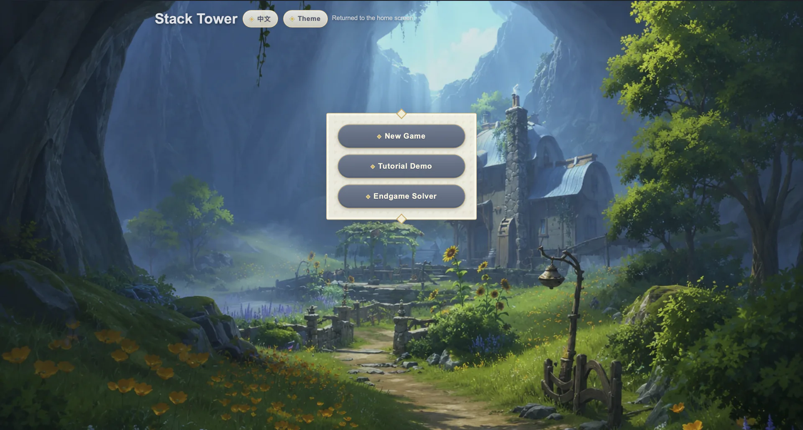
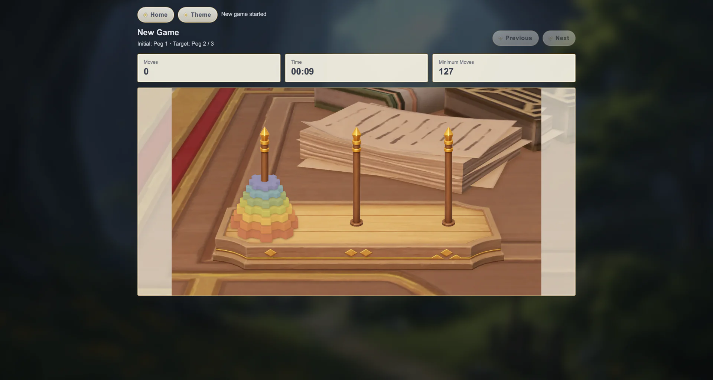
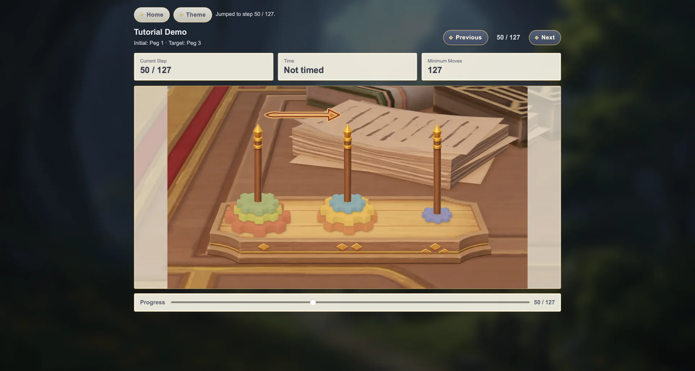

# Stack Tower

[中文](README.md)

Stack Tower is a static browser puzzle game based on the classic Tower of Hanoi rules. It adds a Genshin-inspired theme, an interactive tutorial, and an endgame solver. No server or backend is required: the project can be opened locally or hosted directly with GitHub Pages.

**Play online:** [https://rrrome.github.io/hanoi/](https://rrrome.github.io/hanoi/)

## Highlights

- Includes New Game, Tutorial Demo, and Endgame Solver modes.
- Supports 2 to 10 disks, with 7 selected by default.
- Provides Chinese and English interfaces with Genshin, light, and dark themes.
- Tracks moves, elapsed time, and the theoretical minimum move count.
- Shows optimal solutions with directional arrows, step controls, and a progress slider.
- Adds a themed gear board, interface elements, and landing spark effects in the Genshin theme.
- Runs entirely in the browser without uploading gameplay data.

## Screenshots

### Home Page



The Genshin-inspired home page provides quick access to all three game modes, language settings, and theme controls.

### New Game



New Game supports 2 to 10 gears and displays the current move count, elapsed time, and theoretical minimum moves in real time.

### Tutorial Demo



Tutorial mode uses arrows to show each move and lets players browse the full solution with previous/next controls or the progress slider.

## Game Modes

### New Game

Select the disk count, starting peg, and target peg before playing. Only the top gear on a peg can be moved, and a larger gear cannot be placed on a smaller one. Moves can be undone and redone; making a new move clears the redo history.

### Tutorial Demo

Generates the minimum-move solution for the selected disk count, starting peg, and target peg. The current move is visualized with an arrow and can be reviewed step by step or selected with the progress slider.

### Endgame Solver

Arrange the gears into any legal endgame position, then let the solver calculate a minimum-move path from that state to the target peg. This mode is useful for practice and for exploring different positions.

## Running Locally

No npm dependencies or build step are required. Because the frontend uses ES modules, run the repository through any static file server:

```bash
git clone https://github.com/rrrome/hanoi.git
cd hanoi
python3 -m http.server 8000
```

Then visit `http://localhost:8000`. On Windows, use `py -m http.server 8000`.

## Project Structure

```text
.
├── index.html                 # Page structure and module entry
├── style.css                  # Base themes, layout, and responsive styles
├── genshin-theme.css          # Genshin theme interface styles
├── js/
│   ├── app.js                 # UI state, interactions, and standard rendering
│   ├── game-engine.js         # Rules, history, and solver logic
│   ├── genshin-theme.js       # Genshin assets, gears, arrows, and effects
│   └── i18n.js                # Chinese and English interface text
├── genshin_theme/             # Genshin-inspired images and interface assets
├── demo/                      # README screenshots
├── ASSETS_NOTICE.md           # Third-party and derivative asset notice
└── python_reference/          # Earlier Python version for reference only
```

`game-engine.js` owns rules and state without depending on the DOM. `app.js` coordinates the page and standard Canvas renderer, while `genshin-theme.js` reads state through callbacks and manages its own assets, gear sizing, and effects. Add interface text in `i18n.js`.

The web application only uses the root stylesheets, modules in `js/`, and its static assets. It does not execute or depend on code in `python_reference/`.

## Validation

Check the JavaScript syntax:

```bash
for file in js/*.js; do node --check "$file"; done
```

Run the tests for the reference Python version:

```bash
python3 -m unittest discover -s python_reference -p 'test_*.py'
```

## Font Usage

The interface font stack prefers Hanyi WenHei 65W, using the local font-family names `HYWenHei-65W`, `Hanyi WenHei 65W`, and `汉仪文黑 65W`. The project only references locally installed fonts through CSS and Canvas. It does not include, copy, convert, embed, or redistribute any Hanyi font files, and it does not self-host the font with `@font-face`.

## License

The project's original source code is free and open source under the [MIT License](LICENSE). Third-party and derivative assets are outside the scope of the MIT License; see the [Asset Copyright Notice](ASSETS_NOTICE.md).

## Copyright and Non-Commercial Notice

This project is completely free. It contains no advertising, paid features, sponsorships, or other commercial activity. Its original source code is released under the [MIT License](LICENSE).

This is an unofficial fan-made learning project and is not affiliated with, sponsored by, endorsed by, or authorized by miHoYo, HoYoverse, COGNOSPHERE, or their affiliates. “Genshin Impact” and related game names, characters, scenes, interface designs, artwork, and trademarks remain the property of their respective rights holders.

Some assets in `genshin_theme/` and the Demo images are derivative works based on Genshin Impact screenshots. Others were redrawn with generative-AI assistance and then edited by hand. They are used only for this project's non-commercial theme presentation. The project claims no rights over content originating from the game; this notice does not imply authorization from the relevant rights holders or constitute a legal determination of the materials' status.

The MIT License applies only to the project's original source code and does not automatically grant rights to copy, sublicense, or commercially use third-party or derivative assets. See [ASSETS_NOTICE.md](ASSETS_NOTICE.md) for the complete scope and contact details.

> © All rights reserved by COGNOSPHERE. Other properties belong to their respective owners.
